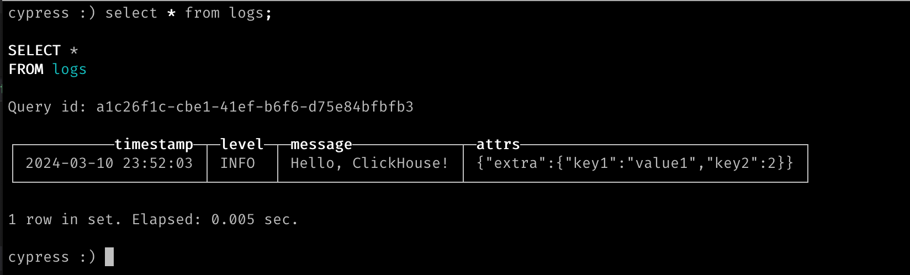

# slog-clickhouse
A ClickHouse Handler for slog Go library.

  [](https://goreportcard.com/report/github.com/smallnest/slog-clickhouse)  [](http://godoc.org/github.com/smallnest/slog-clickhouse)  

**See also:**

- [slog-multi](https://github.com/samber/slog-multi): `slog.Handler` chaining, fanout, routing, failover, load balancing...
- [slog-formatter](https://github.com/samber/slog-formatter): `slog` attribute formatting
- [slog-sampling](https://github.com/samber/slog-sampling): `slog` sampling policy
- [slog-gin](https://github.com/samber/slog-gin): Gin middleware for `slog` logger
- [slog-echo](https://github.com/samber/slog-echo): Echo middleware for `slog` logger
- [slog-fiber](https://github.com/samber/slog-fiber): Fiber middleware for `slog` logger
- [slog-chi](https://github.com/samber/slog-chi): Chi middleware for `slog` logger
- [slog-datadog](https://github.com/samber/slog-datadog): A `slog` handler for `Datadog`
- [slog-rollbar](https://github.com/samber/slog-rollbar): A `slog` handler for `Rollbar`
- [slog-sentry](https://github.com/samber/slog-sentry): A `slog` handler for `Sentry`
- [slog-syslog](https://github.com/samber/slog-syslog): A `slog` handler for `Syslog`
- [slog-logstash](https://github.com/samber/slog-logstash): A `slog` handler for `Logstash`
- [slog-fluentd](https://github.com/samber/slog-fluentd): A `slog` handler for `Fluentd`
- [slog-graylog](https://github.com/samber/slog-graylog): A `slog` handler for `Graylog`
- [slog-loki](https://github.com/samber/slog-loki): A `slog` handler for `Loki`
- [slog-slack](https://github.com/samber/slog-slack): A `slog` handler for `Slack`
- [slog-telegram](https://github.com/samber/slog-telegram): A `slog` handler for `Telegram`
- [slog-mattermost](https://github.com/samber/slog-mattermost): A `slog` handler for `Mattermost`
- [slog-microsoft-teams](https://github.com/samber/slog-microsoft-teams): A `slog` handler for `Microsoft Teams`
- [slog-webhook](https://github.com/samber/slog-webhook): A `slog` handler for `Webhook`
- [slog-kafka](https://github.com/samber/slog-kafka): A `slog` handler for `Kafka`
- [slog-nats](https://github.com/samber/slog-nats): A `slog` handler for `NATS`
- [slog-parquet](https://github.com/samber/slog-parquet): A `slog` handler for `Parquet` + `Object Storage`
- [slog-zap](https://github.com/samber/slog-zap): A `slog` handler for `Zap`
- [slog-zerolog](https://github.com/samber/slog-zerolog): A `slog` handler for `Zerolog`
- [slog-logrus](https://github.com/samber/slog-logrus): A `slog` handler for `Logrus`
- [slog-channel](https://github.com/samber/slog-channel): A `slog` handler for Go channels

## Installation

```bash
go get github.com/smllnest/slog-clickhouse
```

**Compatibility**: `go >= 1.21`

## Usage

### Handler options

```go
type Option struct {
	// log level (default: debug)
	Level slog.Leveler

	// ClickHouse connection
	DB       *sql.DB
	LogTable string
	Timeout  time.Duration // default: 60s

	// optional: customize clickhouse event builder
	Converter Converter

	// optional: see slog.HandlerOptions
	AddSource   bool
	ReplaceAttr func(groups []string, a slog.Attr) slog.Attr
}
```

Other global parameters:
```go
slogclickhouse.SourceKey = "source"
slogclickhouse.ContextKey = "extra"
slogclickhouse.RequestKey = "request"
slogclickhouse.ErrorKeys = []string{"error", "err"}
slogclickhouse.RequestIgnoreHeaders = false
```

### Supported attributes
The following attributes are interpreted by slogclickhouse.DefaultConverter:

|Atribute name|	slog.Kind|	Underlying type|
|---|---|---|
|"error"|	any|	error|
|"request"|	any|	*http.Request|
|other attributes	|*	||


Other attributes will be injected in extra field.

### Example


You must create the table before using it:
```sh
CREATE TABLE logs (
   timestamp DateTime,
   level String,
   message String,
   attrs String
) ENGINE = MergeTree()
ORDER BY timestamp
PARTITION BY toYYYYMMDD(timestamp)
```

then run the below code:

```go
package main

import (
	"log/slog"
	"testing"
	"time"

	"github.com/smallnest/slog-clickhouse"
)

func main() {
	conn := clickhouse.OpenDB(&clickhouse.Options{
		Addr: []string{"127.0.0.1:9000"},
		Auth: clickhouse.Auth{
			Database: "myapp",
			Username: "",
			Password: "",
		},
		Settings: clickhouse.Settings{
			"max_execution_time": 60,
		},
		DialTimeout:          time.Second * 30,
		Debug:                true,
		BlockBufferSize:      10,
		MaxCompressionBuffer: 10240,
	})

	if err := conn.Ping(); err != nil {
		t.Log("local clickhouse server is not running, skipping test...")
		return
	}

	conn.SetMaxIdleConns(5)
	conn.SetMaxOpenConns(10)
	conn.SetConnMaxLifetime(time.Hour)

	logger := slog.New(Option{Level: slog.LevelDebug, DB: conn, LogTable: "myapp.logs"}.NewClickHouseHandler())

	logger.Info("Hello, ClickHouse!", "key1", "value1", "key2", 2)
}
```

check the result in ClickHouse:

